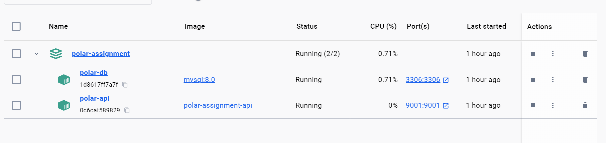
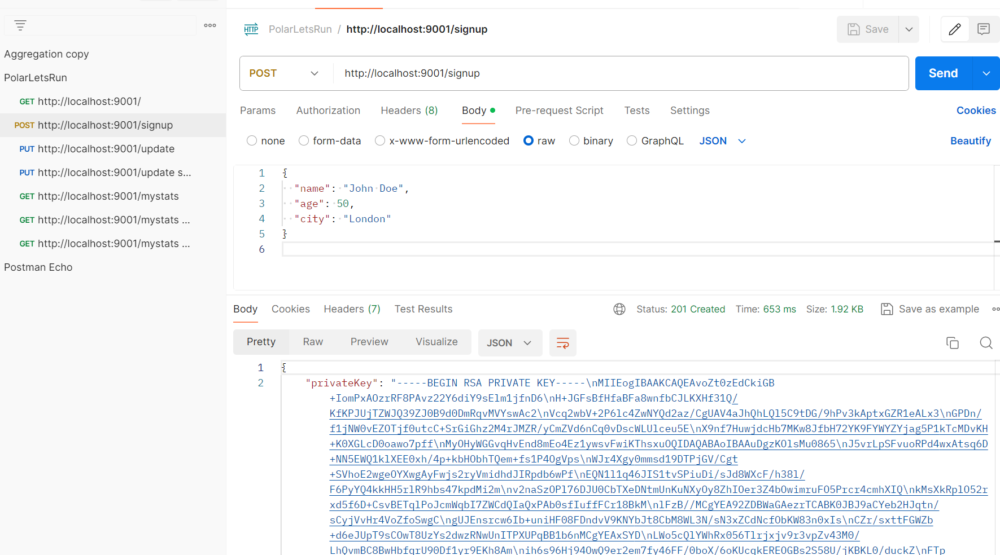

# Polarsec task
The ``` Polarsec task ``` is a back-end for a super cool new app called Lets Run! 

The application is built according to compliance with the [system requirements](https://gitlab.com/polarsec/task).

# Rest API with MySQL 

| Methods	| Urls	          | Actions
| --------- | ----------------| ----------------------------------------- |
| POST      | /signup         | Signs the user up to the application
| PUT       | /update         | Updates the users total running distance
| GET       | /mystats        | Returns the users' ranking


## Project Structure
```bash
├── README.md
├── package-lock.json
├── package.json
+---src
|   |   index.ts
|   |
|   +---controllers
|   |       home.controller.ts
|   |       run.controller.ts
|   |
|   +---db
|   |       index.ts
|   |
|   +---helpers
|   |       cryptoHelper.ts
|   |
|   +---interfaces
|   +---middlewares
|   |       splitRequest.validation.ts
|   |
|   +---models
|   |       person.model.ts
|   |
|   +---repositories
|   |       run.repository.ts
|   |
|   +---routes
|   |       index.ts
|   |       run.routes.ts
|   |
|   \---services
|           run.service.ts
|
\---test
        app.unit.test.ts
└── tsconfig.json
```

## Database
The system uses a mysql database which stores the signed up runners with table structure in : ```init-scripts/init.sql```

## Local Installation
#### Runnning locally as standalone app. 

\* *Environment variables are not required*, application can run with predefined defaults
```sh
$ cd polar-assignment
$ npm install
$ npm run start
```

 #### Runnning locally as production simulation 

- Using docker from the application folder, run ```docker-compose build``` and ```docker-compose up```




## Testing application 

Please use attached [Postman](https://www.getpostman.com/) JSON [collection](./test/PolarLetsRun.postman_collection.json) in order to test API requests
You can import this collaction with prepared requests for tests



## Useful docs
[Crypto documentation](https://nodejs.org/api/crypto.html)

[Key generation example](https://nkhilv.medium.com/generating-a-private-rsa-key-for-tests-node-js-c3fc23b3ef1c)

[Public-key cryptography](https://en.wikipedia.org/wiki/Public-key_cryptography)


